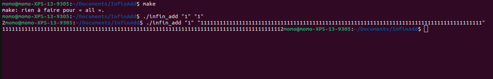

# InfinADD

InfinADD est un des trois projets les plus important du début d'année. 

Le but de ce projet est de créer une calculatrice fonctionnelle, capable d'analyser deux chaînes de données passées en arguments et d'afficher la valeur résultante de l'addition de ses deux chaînes de caractères.

La difficulté va être d'effectuer un calcul avec deux chaînes de caractères d'une longueur infinie.

## But du programme

Créer algorithme qui va additioner deux chaînes de caractère d'une taille inconue.

## Fonctions autorisées

```

	• Write 
	• Malloc
	• free
	
```

## Mise en route

Ces instructions vous permettront d'obtenir une copie du projet opérationnel sur votre machine locale à des fins de développement et de test.

### Pré-requis

De quoi avez-vous besoin pour installer le logiciel et comment l'installer ?

```

gcc
make

```

### Installation

Compilation du projet

```
make
```

Lancement du projet

```
./infin_add
```

## Captures d'écrans

Exemple de lancement et de calcul :



